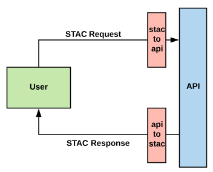

# cognition-datasources

## About
This library defines a STAC-compliant standardized interface for searching geospatial assets, primarily remotely sensed imagery.  The [Spatio-Temporal-Asset-Catalog (STAC)](https://github.com/radiantearth/stac-spec) specification provides common metadata and API schemas to search and access geospatial data.  The standardized interface used by the library is based on the STAC spec and allows searching across three dimensions:

- **Spatial:** Find all assets which intersect a bounding box.
- **Temporal:** Find all assets acquired within a temporal window.
- **Properties:** Find all assets with certain  metadata.

Not all commonly used datasources are currently STAC-compliant.  In such cases, the library maintains a standardized search interface by wrapping the API with a STAC-compatible API which parses the initial search parameters into a format compatable with the underlying API.  A request to the API is sent and the response is parsed into a STAC Item and returned to the user.  The table below of supported datasources states which are STAC-compliant.



## Usage
#### Python
```python
from datasources import Manifest
from datasources.sources import Landsat8, Sentinel2

# Create manifest
manifest = Manifest()

# Load sources
manifest.load_sources(Landsat8, Sentinel2)

# Search arguments
spatial = {"type": "Polygon", "coordinates": [[...]]}
temporal = ("2018-10-30", "2018-12-31")

# Create searches
for source in manifest:
    manifest[source].search(spatial, temporal=temporal)

# Execute searches
response = manifest.execute()
```

#### CLI
```
cognition-datasources search xmin ymin xmax ymax --start-date "2018-10-30" --end-date "2018-12-31" -d Landsat8 -d SRTM --output response.json
```

## Documentation
Read the [quickstart](./docs/quickstart.ipynb) and [documentation](./docs).

## Supported Datasources
| Name | Source | STAC-Compliant | Notes |
|----------------|--------------------------------------------------------------------------|----------------|--------------------------------------------------------------------------------------------------------------------------------------------------------------------------------------------|
| ElevationTiles | [AWS Earth: Terrain Tiles](https://registry.opendata.aws/terrain-tiles/) | False | Sends header requests to AWS S3 Bucket. |
| CBERS | [AWS Earth: CBERS](https://registry.opendata.aws/cbers/) | False | Sends requests to AWS S3 Bucket (**RequesterPays**) with help of [aws-sat-api](https://github.com/RemotePixel/aws-sat-api-py). |
| Landsat8 | [AWS Earth: Landsat8](https://registry.opendata.aws/landsat-8/) | True | Sends requests to [sat-api]( https://github.com/sat-utils/sat-api). |
| NAIP | [AWS Earth: NAIP](https://registry.opendata.aws/naip/) | False | Sends requests to AWS S3 Bucket (**RequesterPays**). |
| Sentinel1 | [Copernicus Open Access Hub](https://scihub.copernicus.eu/) | False | Sends requests to [CopernicusAPIHub](https://scihub.copernicus.eu/twiki/do/view/SciHubWebPortal/APIHubDescription) with help of [sentinelsat](https://github.com/sentinelsat/sentinelsat). |
| Sentinel2 | [AWS Earth: Sentinel2](https://registry.opendata.aws/sentinel-2/) | True | Sends requests to [sat-api](https://github.com/sat-utils/sat-api). |
| SRTM | [AWS: Terrain Tiles](https://registry.opendata.aws/terrain-tiles/) | False | Does not send any requests. |
| Microsoft Building Footprints | [Microsoft](https://github.com/Microsoft/USBuildingFootprints) / [ESRI](https://www.arcgis.com/home/item.html?id=f40326b0dea54330ae39584012807126) | False | Sends requests to ESRI Feature Layer |