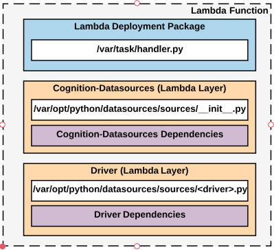

# Contributing

The purpose of this page is to explain how to contribute to the library by building your own driver for use with cognition-datasources.

## Datasource Driver
A datasource driver is a high-level wrapper of the underlying API which translates between STAC-compliant and API-compliant requests/responses and is very similar conceptually to the [GraphQL resolver](https://graphql.org/learn/execution/#root-fields-resolvers).  It inherits a standard pattern defined in the [sources.base.Datasource](../datasources/sources/base.py) base class.  Realistically, a driver will look something like this:

```python
class MyDatasource(Datasource):
    
    stac_compliant = False
    tags = ['Raster', 'MS']
    
    def __init__(self, manifest):
        self.manifest = manifest
       
    def search(self, spatial, temporal=None, properties=None, limit=10, **kwargs):
        stac_query = STACQuery(spatial, temporal, properties)
        
        
        request = # logic to parse user input into API request
        
        self.manifest.sources.append([self, request])
        
    def execute(self, request):
        response = # query API with request
        
        stac_item = # logic to parse response into STAC item
        
        STACItem.load(stac_item) # soft schema validation
        
        return [stac_item]
```

There are a couple of things happening here, let's go over them.


##### Class Attributes
- **stac_compliant** indicates whether or not the underlying API is STAC compliant.  Used internally for orchestration.
- **tags** are used to sort datasources into functional groups for querying (see [datasources.sources.__init__.py](../datasources/sources/__init__.py)).

##### Init
- The only required input parameter is the manifest, which is essentially a context manager for performing multiple searches across multiple datasources in parallel.  

##### Search method
- The search method takes the STAC compliant input and generates an API-compatible request.
- User input is separated into a couple parameters:
  - **spatial**: geojson geometry representing the spatial extent of the query.
  - **temporal**: temporal range representing the temporal extent of the query.
  - **properties**: STAC or legacy properties used to query the API and/or filter the response.
  - **limit**: limits response to a maximum number of returned items.
  - **kwargs**: API-specific keyword arguments.
- The [datasources.stac.query.STACQuery](../datasources/stac/query.py) object validates the user input to ensure it is STAC compliant, and provides some handy methods such as bounding box calculation and temporal filtering.
- Both the API request and a reference to the datasource is appended to **self.manifest.sources**
- Executes in the main thread.

##### Execute method
- The **request** parameter of the execute method consumes API requests stored in the `self.manifest.sources` list.
- Ping the API and implement logic to parse the response into a valid STAC item.
- The [datasources.stac.item.STACITem](../datasources/stac/item.py) object performs a soft validation of the STAC Item to ensure all the required fields are present.
- If the API is STAC compliant, the execute method should return the API response without any modification.  If the API is not STAC compliant, it should return a list of STAC Item(s).
- Executes in worker threads spawned by `multiprocess.Process`.

---

## Driver Setup
Now that we know a little about the structure of drivers, let's learn how to build one!  Cognition-datasources provides a CLI script for generating a starter project in a new directory.  Let's create a new datasource representing the fake satellite **FakeSat**.

**(1). Run the command `cognition-datasources new --name FakeSat`**

Our new directory will look like this:

```
.
└── FakeSat                         # Parent directory.
    ├── .circleci                   
    │   └── config.yml              # CircleCI configuration.
    ├── bin
    │   └── driver-package.sh       # Packages driver inside Docker container.
    ├── config.yml                  # Driver configuration.
    ├── Dockerfile                  # Docker container.
    ├── docs
    │   ├── example.json            # Example STAC Item generated by driver.
    ├── FakeSat.py                  # Driver file.
    ├── handler.py                  # Lambda function which calls your driver.
    ├── README.md                   # Driver documentation.
    ├── requirements-dev.txt        # Testing dependencies.
    ├── requirements.txt            # Production dependencies.
    └── tests.py                    # Unittests.
```

The starter-project contains everything we need to build a datasource:
- **Business Logic:** The underlying logic of our driver is contained in `FakeSat.py`
- **Dependencies:** Any dependencies not required by cognition-datasources are listed in `requirements.txt` (for use in production) and `requirements-dev.txt` (for use in testing/building).
- **Documentation:** Each driver at minimum provides an example STAC item returned by the driver (`example.json`) and basic documentation of the available API parameters (`README.md`)
- **CI/CD:** Each driver contains a default CircleCI project (`.circleci`) for deploying CI.

**(2). Implement our business logic in the driver file (`FakeSat.py`)**

Let's pretend our `FakeSat` data is exposed via a simple REST API (`https://FakeSat.com/data`) and accepts a POST request:

```json
{
  "intersects": [-118, 32, -116, 34],
  "acquisitionDate": {
    "day": 30,
    "month": 10,
    "year": 2017
  },
  "gsd": 1.5,
  "epsg": 4326,
  "processing": "L1B",
  "limit": 10,
}
```

Our fake API will have a simple response:

```json
{
  "assetId": 12345,
  "assetName": "something.tif",
  "geometry": {"type": "Polygon", "coordinates": [[[-118, 34], [-116, 34], [-116, 32], [-118, 32], [-118, 34]]]},
  "properties": {
    "day": 30,
    "month": 10,
    "year": 2017,
    "gsd": 1.5,
    "epsg": 4326,
    "processing": "L1B"
  }
}
```

We can see that there are both spatial and temporal elements as well as additional properties we can map to the STAC spec (eo:gsd and eo:epsg).  Any properties which don't fit nicely into the STAC spec may be mapped to the legacy extension.  We will use the `search` and `execute` methods to wrap the STAC-spec around the FakeSat api.  You are free to implement this logic however you like, as long as you adhere to the standard input and output patterns.

```python
import requests
import json

from datasources.stac.query import STACQuery
from datasources.stac.item import STACItem
from datasources.sources.base import Datasource


class FakeSat(Datasource):

    stac_compliant = False
    tags = ['EO']

    def __init__(self, manifest):
        super().__init__(manifest)
        self.endpoint = 'https://FakeSat.com/data'
    
    def search(self, spatial, temporal=None, properties=None, limit=10, **kwargs):
        # Validates the input query and provides helper methods for working with query
        stac_query = STACQuery(spatial, temporal, properties)
        
        # Create API request from input
        api_request = {
            'intersects': stac_query.bbox(),
            'acquisitionDate': {
                'day': stac_query.temporal.day,
                'month': stac_query.temporal.month,
                'year': stac_query.temporal.year
            }
        }
        
        if properties:
        # Map from stac keywords to API keywords
            keys = list(properties)
            if 'eo:gsd' in keys:
                api_request.update({'gsd': stac_query.properties['eo:gsd']['eq']})
            if 'eo:epsg' in keys:
                api_request.update({'epsg': stac_query.properties['eo:epsg']['eq']})
            # Use the legacy collection for keys that don't map to STAC
            if 'legacy:processing_level' in keys:
                api_request.update({'processing': stac_query.properties['legacy:processing']['eq']})
        
        # Append to manifest
        self.manifest.searches.append([self, api_request])

    def execute(self, api_request):
        response = requests.post(self.endpoint, data=json.dumps(api_request))
        contents = response.json()
        
        # Bbox
        xvals = [x[0] for x in contents['geometry']['coordinates'][0]]
        yvals = [y[1] for y in contents['geometry']['coordinates'][0]]
        
        # Parse response into STAC Item (with exception of Links)
        stac_item = {
            "id": str(contents['assetId']),
            "type": "Feature",
            "bbox": [min(xvals), min(yvals), max(xvals), max(yvals)],
            "geometry": contents['geometry'],
            "properties": {
                "datetime": "{}-{}-{}T00.00.00Z".format(contents['properties']['year'],
                                                        contents['properties']['month'],
                                                        contents['properties']['day']),
                "eo:epsg": contents['properties']['epsg'],
                "eo:gsd": contents['properties']['gsd'],
                "legacy:processing": contents['properties']['processing']
            }
        }
        
        # Soft validation of STAC Item
        STACItem.load(stac_item)
        
        return [stac_item]
```

**(3) Define test cases in `tests.py` by providing example spatial, temporal, properties, and limit arguments.**

Each driver must pass a [standard set of test cases](../datasources/tests.py):
- Confirm that items returned by the query spatially intersect the search geometry (spatial test).
- Confirm that items returned by the query temporally intersect the temporal window (temporal test).
- Confirm that items returned by the query are STAC Compliant (stac test).
- Confirm that the driver succesfully implements a `limit` keyword argument.

```python
from datasources import tests

from FakeSat import FakeSat

class FakeSatTestCases(tests.BaseTestCases):

    def _setUp(self):

        self.datasource = FakeSat
        self.spatial = {
                        "type": "Polygon",
                        "coordinates": [
                          [
                            [
                              -118.45184326171875,
                              33.8362013852728
                            ],
                            [
                              -118.0316162109375,
                              33.8362013852728
                            ],
                            [
                              -118.0316162109375,
                              34.127721186043985
                            ],
                            [
                              -118.45184326171875,
                              34.127721186043985
                            ],
                            [
                              -118.45184326171875,
                              33.8362013852728
                            ]
                          ]
                        ]
                      }
        self.temporal = ("2017-10-30", "2017-10-30")
        self.properties = {'eo:epsg': {'eq': 4326}}
        self.limit = 10
```

You can add additional test cases as needed.  The easiest way to run test cases is via Docker:

```
# Build Docker container
docker build . -t fakesat-driver:latest

# Run tests
docker run --rm -v $PWD:/home/cognition-datasources -it fakesat-driver:latest python -m unittest tests.py
```

**(4). Update `requirements.txt` and `requirements-dev.txt` with any dependencies required by your driver.**

**(5). Update documentation in the `docs` folder**
- `example.json` should contain an example STAC item from the driver (see [examples](examples))
- `README.md` should contain two tables.  The first indicates which input fields are supported by the driver.  The second provides a simple schema of the STAC properties exposed by the driver.

**(6). Publish directory to public GitHub repo and set up CircleCi.**

CircleCI is a simple, cloud-hosted, continuous integration system with good integration with GitHub.  Cognition-datasoures requires that all drivers have a CircleCI configuration.  When loading new datasources, CircleCI is used to ensure that the datasource is functional and has passed the required test cases.  The starter-project provides a default CircleCI configuration in the `.circleci` folder which should suffice for the large majority of drivers.  Follow these steps to configure CircleCI:

1. Login to [CircleCI via Github](https://circleci.com/integrations/github/).
2. Click `Add Projects` on the side of the dashboard and then `Set Up Project` next to the appropriate repository.
3. Click `Start building`

**(7). Add your CircleCI build API key to `config.yml`**
Cognition-datasources requires access to your project's API Key to determine whether or not the driver has built succesfully.  You can obtain your project-specific API Key using the following instructions.

1. From the CircleCI project page, go to settings by clicking the gear in the top right corner.
2. Click `API Permissions`
3. Click `Create Token`.  Change the scope to `All` and the token label to whatever you want.
4. Copy and paste the token to `config.yml` under the `circle-token` key.

**NOTE: Do not commit your account level API key, please make sure you are generating a project-level key with the above steps before committing**

**(8). Add your CircleCI build status badge to the first line of `docs/README.md`**

1. From the CircleCI project page, go to settings by clicking the gear in the top right corner.
2. Click `StatusBadges`
3. Ensure `Embed Code` is set to Markdown and copy/paste the code to the first line of `docs/README.md`.

**(9). Deploy your driver as an AWS Lambda Layer.**

```
# Build Docker container
docker build . -t fakesat-driver:latest

# Package the layer
docker run --rm -v $PWD:/home/cognition-datasources -it fakesat-driver:latest driver-package.sh

# Deploy layer to lambda
aws lambda publish-layer-version \
    --layer-name fakesat-driver \
    --zip-file fileb://lambda-layer.zip

# Make layer public
aws lambda add-layer-version-permission --layer-name fakesat-driver \
    --statement-id public --version-number 1 --principal '*' \
    --action lambda:GetLayerVersion
```

**(10). Add your layer's arn to `config.yml`, making sure to include the version tag.**

**(11). Register your driver in cognition-datasources via pull request**
Register your driver in [datasources.sources.__init__.py](../datasources/sources/__init__.py) by creating a class attribute in the `remote` object containing the url to the driver's master branch.  Make sure the url is pointing to [jsDelivr](https://www.jsdelivr.com/).  

```python
class remote(object):

    FakeSat = "https://cdn.jsdelivr.net/gh/geospatial-jeff/cognition-datasources-fakesat"
```

Submit the pull request into dev and your driver will be included with the next release!  Another user can load our fake driver with `cognition-datasources load -d FakeSat`!

## Additional Notes
### Spatial Handling
A common solution when working with datasources which don't directly expose spatial queries is to save a spatial coverage of the dataset to a database (ex. PostGIS).  This isn't a viable option for cognition-datasources for several reasons.  The library supports packaging spatial coverages with your driver through an [AWS Lambda Spatial Database](https://github.com/geospatial-jeff/lambda-layer-spatial-db).  The coverage is written to disk and saved to an AWS Lambda Layer which is loaded by cognition-datasources in addition to the driver layer itself.

Let's pretend the FakeSat API wasn't an API but a FTP server with a flat file structure of images.  In order to expose a spatial query on the underlying dataset, we can write a program which crawls the FTP server and generates spatial coverages from image metadata.  We can then package the spatial coverages with our driver to satisfy the spatial requirements of the STAC query.

**(1). Clone the `lambda-layer-spatial-db` library into the `spatial-db` folder.**

```
git clone https://github.com/geospatial-jeff/lambda-layer-spatial-db.git spatial-db
cd spatial-db
```

**(2). Follow the [database-docs](https://github.com/geospatial-jeff/lambda-layer-spatial-db/blob/master/docs/README.md) to package and deploy your spatial coverages as an AWS Lambda Layer.**

**(3). Update your driver's `Dockerfile` to pull from `geospatialjeff/cognition-datasources-db:latest`.**

**(4). Update your CircleCI configurations (`.circleci/config.yml`) docker image to pull from `geospatialjeff/cognition-datasources-db:latest`**

**(5). Add a `db-arn` key in your driver's configuration (`config.yml`) which maps to your database layer ARN.**

You can now perform a basic bounding box query on the packaged spatial coverages from within our driver.  For an implementation example, see the [NAIP driver](https://github.com/geospatial-jeff/cognition-datasources-naip).

### How It Works
Upon initialization, cognition-datasources uses a [simple loader](../datasources/sources/__init__.py) (see `collections.load_sources`) which loads all drivers found in the `./datasources/sources` folder.  When installing locally, the driver file (`FakeSat.py`) is moved into the `sources` folder which allows local calls to cognition-datasources.  The serverless deployment packages each datasource as a lambda function which takes advantage of how AWS Lambda Layers are merged at runtime.



Each lambda function pulls from two lambda layers (three if packaged with spatial coverages): the cognition-datasources layer and the driver layer.  When the layers are merged at runtime, the driver file is placed into the appropriate folder which allows cognition-datasources to successfully load the driver inside `handler.py`.